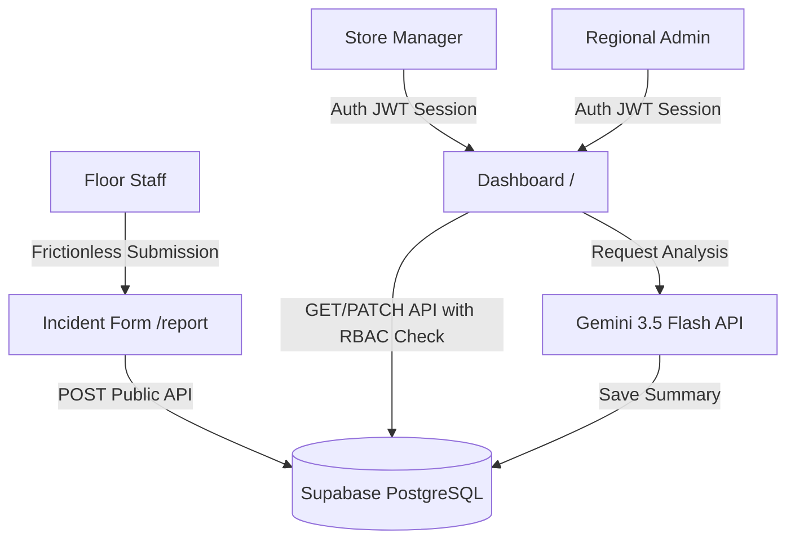

# 🌯 California Burrito — Incident Command Center & Operations Portal

A premium, production-grade operations management portal and incident reporting console built for the **California Burrito** restaurant chain. The portal enables floor staff to instantly log operational issues, while managers and regional directors can securely analyze trends, manage statuses, and review AI-driven resolution guides in a centralized dashboard.

---

## 🔒 Demo Portal Credentials

Use the pre-seeded credentials below to test role-based data isolation (RBAC):

### 1. Global Admin (Regional Director)
- **Scope:** Views and manages incidents across all stores globally.
- **Email:** `admin@californiaburrito.com`
- **Password:** `admin123`

### 2. Store Managers (Branch Restricted)
Managers are locked to their own store scope. They cannot view or modify incidents from other branches:
- **Downtown LA Store Manager:** `dtla@californiaburrito.com` | **Password:** `manager123`
- **Santa Monica Store Manager:** `sm@californiaburrito.com` | **Password:** `manager123`
- **San Diego Store Manager:** `sd@californiaburrito.com` | **Password:** `manager123`
- **San Francisco Store Manager:** `sf@californiaburrito.com` | **Password:** `manager123`
- **Oakland Store Manager:** `oakland@californiaburrito.com` | **Password:** `manager123`

---

## 🏗️ Technical Architecture & Design Patterns

The portal is designed for high reliability, fast serverless response times, and bulletproof security:



### 1. Security & Authentication Layer (NextAuth.js)
- **Frictionless Entry:** `/report` remains open-access so floor staff can log issues in under 60 seconds without logging in.
- **JWT Scoping:** NextAuth interceptor callbacks append `role` and `storeLocation` claims directly to the JSON Web Token.
- **Strict Server-side RBAC:** API route handlers (`/api/incidents/[id]`) read the JWT session on the server. If the role is `manager`, the system compares the incident's location to the manager's profile. Any mismatch instantly aborts with a `403 Forbidden` response.

### 2. Database & Connection Pooling
- **Supabase PostgreSQL:** Managed cloud relational database containing the `incidents` table.
- **Prisma ORM Mapping:** Schema maps model properties using mapping attributes (e.g., `@@map("incidents")`) to match PostgreSQL naming conventions.
- **Connection Pooling:** We configured Prisma with a double-datasource URL design:
  - `DATABASE_URL` routes through the **Supabase Pooler (Port 6543)** in Transaction Mode (`pgbouncer=true`) to optimize connections in serverless environments.
  - `DIRECT_URL` connects directly on **Port 5432** in Session Mode to run database schema pushes and migrations.

---

## 🖥️ Incident Command Center (Dashboard)

The main dashboard acts as a real-time command console for restaurant leadership:

* **Live Status Badge:** Displays a pulsing operations indicator:
  - 🟢 `ALL SYSTEMS OPERATIONAL` (All tickets closed or resolved)
  - 🟡 `WARNING ALERTS` (Open high-severity incidents)
  - 🔴 `CRITICAL INCIDENTS` (Active critical-severity incidents)
* **Glassmorphic Stats Bar:** Summarizes metrics (Total, Open, In Progress, Critical, Resolved) using translucent backgrounds (`backdrop-filter: blur`) and colored neon dropshadow glows.
* **Smart Filter & Search Bar:** Combines fuzzy textual search with dropdown selectors for Category, Severity, and Status. The UI instantly updates client-side states with smooth list animations.
* **Interactive Cards:** Hovering on cards lifts them up and displays a sliding overlay button directing managers to the detail page. Left border accents display color indicators matching severity levels (Low: Green, Critical: Pulsing Red).

---

## 📊 Analytics Section & Timezone Synchronization

The **Analytics Dashboard** provides regional directors with high-level summaries of restaurant health:

```
+-------------------------------------------------------------+
|                     OPERATIONAL TRENDS                      |
|  [Line Chart: 7-Day Trend]      [Bar Chart: Severity Count] |
|                                                             |
|  [Donut Chart: Categories]      [Horizontal: Status Layout] |
+-------------------------------------------------------------+
```

* **Data Visualizations (Recharts):**
  - **7-Day Trend Line:** Displays daily incident volume with custom active dot indicator rings.
  - **Severity Bar Chart:** Shows distribution count of Low, Medium, High, and Critical tickets.
  - **Category Donut:** Features custom-colored pie segments detailing which departments (POS, Inventory, Kitchen, Complaints) represent the most frequent bottlenecks.
  - **Status Layout:** Horizontal progress bars reflecting outstanding workload.
* **Timezone Offset Bug Resolution:**
  - **The Problem:** Converting date strings to UTC on the client via `toISOString().split('T')[0]` shifts dates backward or forward depending on the browser's timezone offset (e.g., IST is +5:30). This caused newly logged incidents to disappear from the trend chart depending on what hour of the day they were filed.
  - **The Solution:** We implemented a custom `getLocalDateString()` helper that extracts local year, month, and day components. This aligns both the daily trend buckets and database timestamps to the user's local calendar day, ensuring **100% chart accuracy in any timezone**.

---

## 📁 Directory Structure

```
california-burrito-incidents/
├── prisma/
│   ├── schema.prisma          # Database models (PostgreSQL provider, pooling URL, direct URL)
│   ├── seed.js                # Database seeder (Idempotent: clears old logs before inserting)
│   └── dev.db                 # Legacy SQLite db file (Ignored in production)
├── src/
│   ├── app/
│   │   ├── layout.js          # Root layout with fonts & NextAuth provider wrapper
│   │   ├── page.js            # Dashboard (handles stats, filters, grid rendering)
│   │   ├── globals.css        # Full CSS custom properties, grid layouts, animations
│   │   ├── icon.png           # California Burrito logo favicon asset
│   │   ├── report/page.js     # Public incident submission form page
│   │   ├── incident/[id]/page.js  # Incident details & AI Summary display
│   │   └── api/
│   │       ├── auth/          # NextAuth catch-all routes
│   │       ├── incidents/
│   │       │   ├── route.js       # GET (requires auth) + POST (public)
│   │       │   └── [id]/route.js  # GET, PUT, PATCH, DELETE (Strict server-side RBAC)
│   │       └── ai/summarize/route.js  # AI summary generation (Strict RBAC checks)
│   ├── components/
│   │   ├── Header.js          # Navigation bar (responsive drawer menu, System Login link)
│   │   ├── StatsBar.js        # Analytics cards with neon border glows
│   │   ├── FilterBar.js       # Filtering dropdowns with Lucide indicators
│   │   ├── IncidentCard.js    # Interactive cards with hover details and severity borders
│   │   └── Toast.js           # Feedback notifications
│   └── lib/
│       ├── prisma.js          # PrismaClient client singleton
│       ├── auth.js            # NextAuth credential provider rules & demo users
│       └── utils.js           # Date and timezone formatting utilities
├── package.json               # Prefix scripts ("prisma generate && next build")
└── README.md                  # Comprehensive architectural documentation
```

---

## 🚀 Setup & Installation

### Prerequisites
- Node.js 18+ installed
- npm or yarn

### 1. Clone & Install
```bash
git clone https://github.com/rohitnk464/Restaurant-incident-reporting-tool.git
cd Restaurant-incident-reporting-tool/california-burrito-incidents
npm install
```

### 2. Configure Environment Variables
Create a `.env` file in the root of the `california-burrito-incidents` folder:
```env
DATABASE_URL="postgresql://postgres.[YOUR-PROJECT-REF]:[YOUR-PASSWORD]@[YOUR-POOLER-HOST]:6543/postgres?pgbouncer=true"
DIRECT_URL="postgresql://postgres.[YOUR-PROJECT-REF]:[YOUR-PASSWORD]@[YOUR-POOLER-HOST]:5432/postgres"

NEXTAUTH_SECRET="california-burrito-super-secret-key-2026"
GEMINI_API_KEY="[Your active Gemini Key]"
```

### 3. Initialize Database
Create the PostgreSQL tables in Supabase and seed the initial operational logs:
```bash
# Push Prisma schema definitions
npx prisma db push

# Run idempotent database seeder
node prisma/seed.js
```

### 4. Run Development Server
```bash
npm run dev
```
Open [http://localhost:3000](http://localhost:3000) to view the portal locally.
